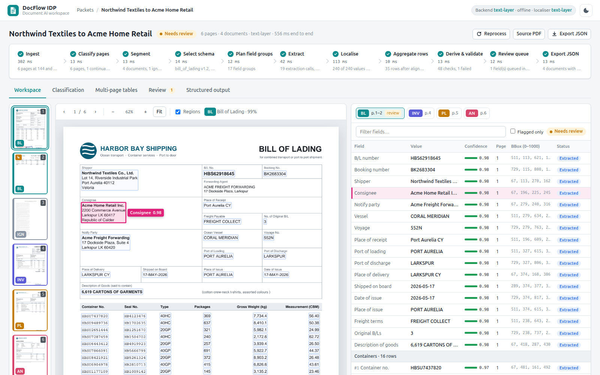
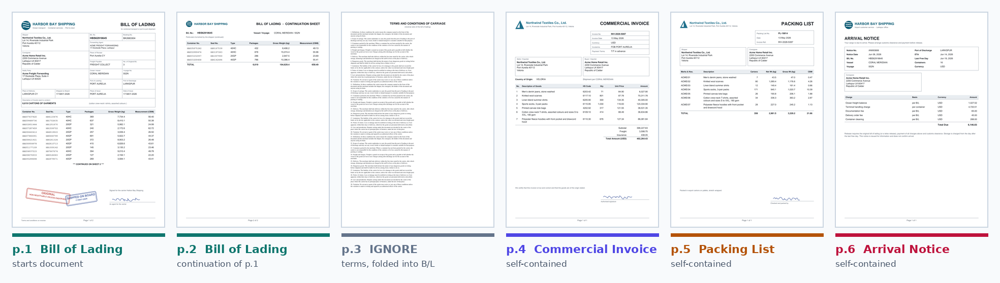
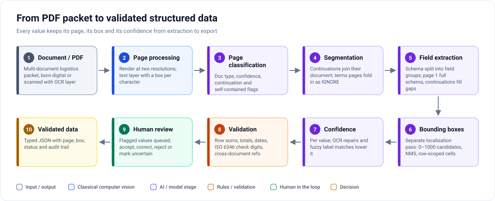
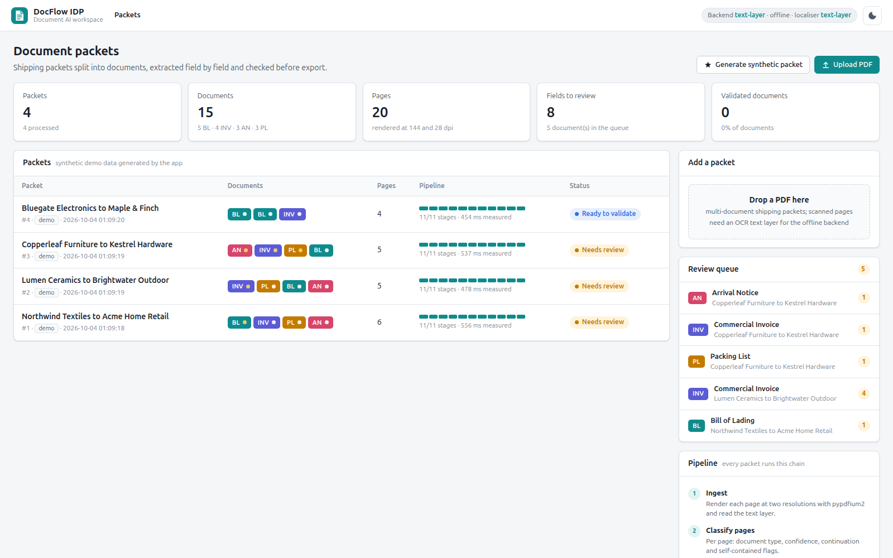
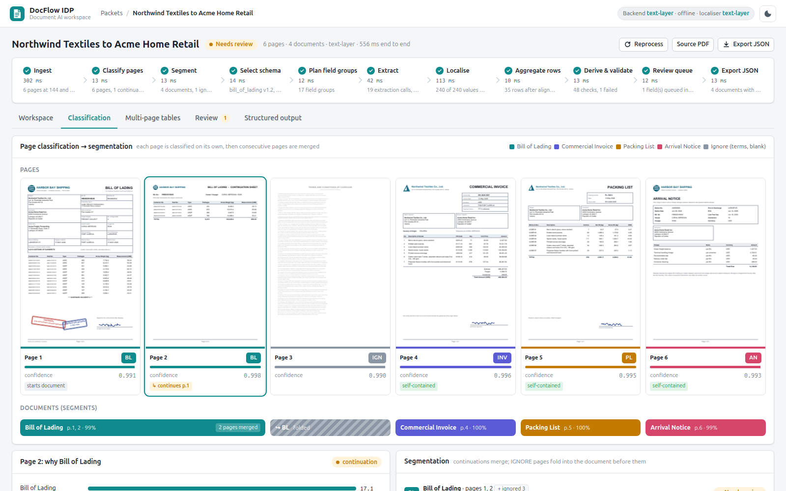
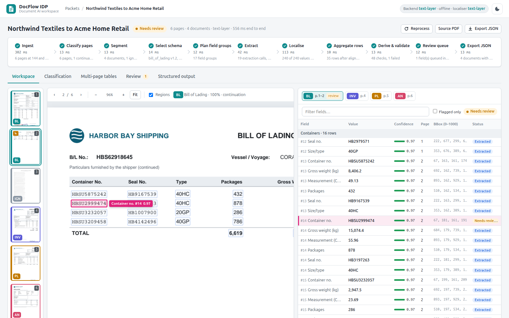
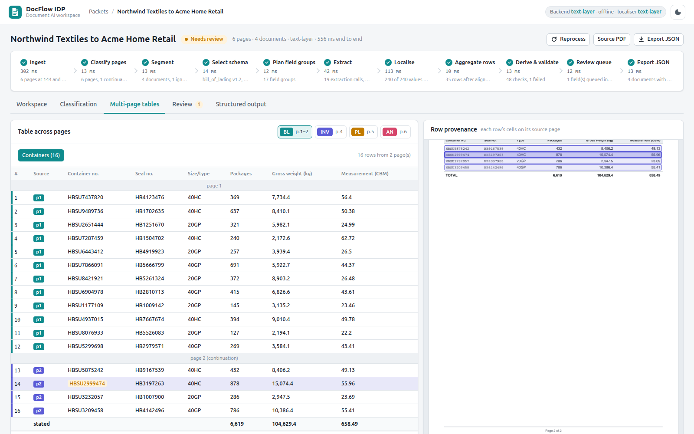
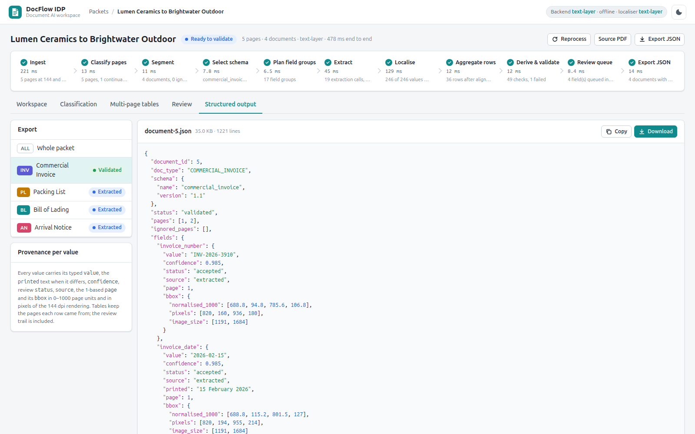
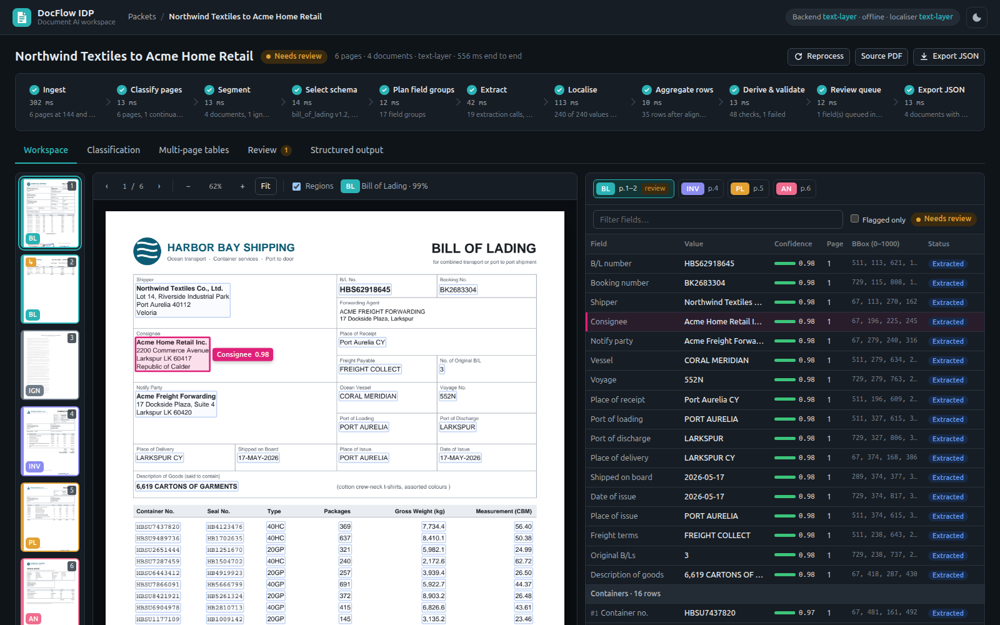
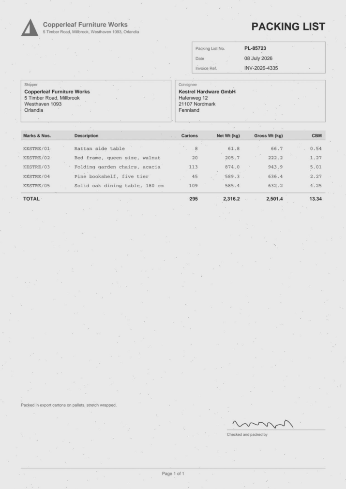

# DocFlow IDP — Intelligent Document Processing

**Turn a mixed PDF packet of shipping documents into validated, structured data — with every value traced to its page and box, and a human in the loop for anything doubtful.**

| | |
|---|---|
| **What it is** | A document AI workspace: a FastAPI service and a browser UI that classifies every page of a logistics packet, splits it into documents, extracts schema fields with their bounding boxes, validates them with business rules and routes doubtful values to a review queue. |
| **Why it matters** | Extraction alone is not enough in operations. A reviewer must see *where* each value came from, *why* it was flagged, and leave a record of every correction before data goes downstream. |
| **AI concepts** | Page classification with continuation flags · continuation-aware segmentation · schema-driven grouped extraction · separate bbox localisation pass (0–1000 coordinates, NMS) · multi-page table aggregation · confidence-driven review |
| **Scope** | Portfolio re-implementation on **synthetic** packets, mirroring a production design the author built earlier. Source code is not published here. |

---

## Overview

A shipment usually arrives as one PDF: a bill of lading whose container list runs onto a continuation sheet, terms and conditions on the back, a two-page commercial invoice, a scanned packing list and an arrival notice. Someone has to work out which pages belong together, type the values into a system and check that the numbers add up.

DocFlow IDP is built around that job. It keeps the **what** (the value), the **where** (page and box) and the **how sure** (confidence and rule results) together from the first stage to the export, and makes the review loop a first-class part of the pipeline rather than an afterthought.

A synthetic six-page packet and how each page is classified. Every company, port, vessel and number is invented.

## Key Capabilities

| Capability | What it does |
|---|---|
| **Page classification** | Document type, confidence, *continuation* flag and *self-contained* flag per page; terms and blank pages become `IGNORE`. |
| **Segmentation** | Continuation pages join the open document of the same type; two bills of lading back to back stay apart; `IGNORE` pages fold into the document before them. |
| **Schema-driven extraction** | Each document type has a typed schema (party blocks, dates, money, container numbers, tables). Fields are extracted in small planned groups; page 1 gets the full schema, continuation pages only fill what is still empty and append table rows. |
| **Bounding boxes** | A separate localisation pass returns candidate boxes in 0–1000 page coordinates; non-maximum suppression keeps the best one; table cells are searched inside their row. |
| **Multi-page tables** | Rows collected page by page are aligned: wrapped lines merged, "carried forward" lines dropped, duplicates removed, each row tagged with its source page. |
| **Validation** | Totals vs. row sums (with tolerances), quantity × unit price, date order, ISO 6346 container check digits, required fields, formats and cross-document references. |
| **Human review** | Values below 0.80 confidence, OCR repairs, unlocated values and values involved in a failing rule are queued. Reviewers accept, correct, reject or mark uncertain; every decision re-runs the rules. |
| **Structured output** | Typed JSON per document or packet with provenance for every value: printed text, confidence, status, page and box (page units and pixels). |

## System Architecture

The pipeline core has no web dependency; the service is a thin API over it, and processing runs on a background worker. Every model call — classify a page, extract a field group, localise a value — goes through one small **backend contract**, so an offline baseline and vision-language model (VLM) backends are interchangeable. More in [docs/architecture.md](docs/architecture.md).

## Workflow

Each of the eleven stages is timed and reports a one-line result in the UI ("246 of 246 values placed on the page", "49 checks, 1 failed"). Step by step in [docs/workflow.md](docs/workflow.md).

## Technical Highlights

- **Provenance end to end.** A value is never separated from its page, its box and its confidence — not in the review panel, not in the export.
- **Continuation-aware processing.** Classification sees the previous page's verdict; extraction on continuation pages is restricted to missing fields plus table rows, which prevents a later page from silently overwriting page 1.
- **Localisation as its own pass.** Extracting *what* and finding *where* are separate model tasks, so each can be measured, replaced or fine-tuned independently.
- **Rules that explain themselves.** A failing rule names its fields ("components sum to 624,869.11, document states 624,969.11, difference +100.00"), and those fields are flagged together.
- **Review that cannot be skipped.** A document cannot be validated while a field is waiting, uncertain or a failing rule has not been looked at.
- **Pluggable models.** The default backend works offline on the PDF text layer; OpenAI-compatible and Gemini VLM backends answer the same contract from the page image.

Deeper notes: [docs/technical_overview.md](docs/technical_overview.md).

## User Interface

### Extracted → Needs Review → Validated

| 1 · Extracted | 2 · Needs review | 3 · Validated |
|---|---|---|
|  |  |  |
| Every value outlined on its page, with confidence, page and box. | In `trung.pn`'s review queue: the invoice total is 100.00 more than its components: the sum rule fails, the four fields involved are queued, the source region is shown, and validation is blocked. | `trung.pn` corrects the total with a note, the rules re-run, `nghia.pn` signs off the unflagged values and `tai.tv` validates. The audit trail records who changed what and why. |

### More screens

| | |
|---|---|
|  **Packet dashboard** — packets with their documents, stage progress, status and the review queue `trung.pn` works through. |  **Classification → segmentation** — type, confidence and flags per page; the continuation sheet merged, the terms page folded into the bill of lading. |
|  **Localisation** — a container number on the continuation sheet, flagged because its ISO 6346 check digit is wrong. |  **Multi-page tables** — sixteen containers read from two pages, each row tagged and outlined on its source page. |
|  **Structured output** — typed values with printed text, confidence, status, page and box. |  **Dark theme.** |

## Engineering Focus

- **Designing for review, not just extraction** — the review queue, state machine and audit trail are part of the data model, not a UI layer on top.
- **Separating model tasks behind contracts** — classification, extraction and localisation are independent calls with structured outputs, which keeps prompts small and makes each task replaceable by an API model, a local model or a heuristic baseline.
- **Multi-page robustness** — continuation detection, gap-filling extraction and row alignment are where real packets break naive page-by-page pipelines.
- **Deterministic test harness** — a seeded packet generator records ground truth for every value and box, so the whole pipeline can be checked automatically.
- **Explainable confidence** — confidence is lowered for concrete reasons (OCR digit/letter repair, approximate label match, weak title) and the reason is shown to the reviewer.

## Model Strategy

This repository mirrors the design of a production document-understanding system the author built earlier for heterogeneous logistics PDFs. The stages are kept apart on purpose:

| Stage | Models | Reported result |
|---|---|---|
| Proof of concept | — | ~96 % average accuracy, ~60 s/document |
| **Enhanced production pipeline** | External VLM API (Gemini / Vertex AI) for classification and extraction; bounding boxes also from an external API | **~97 % average accuracy, 16–20 s/document** on a 24-document Bill of Lading test set |
| Local fine-tuning (later) | Qwen3-VL-4B-Instruct, QLoRA (4-bit, LoRA adapters, single RTX 3090 24 GB) | Experimentation toward local joint extraction + bbox localisation — **no metric is claimed** |
| This repository | Offline text-layer baseline; optional VLM backends | Synthetic consistency checks only |

> The ~97 % figure belongs to the **enhanced pipeline built on an external VLM API**. It is not a result of Qwen3-VL, of any fine-tuned model, or of this repository. Details: [docs/model_strategy.md](docs/model_strategy.md).

## Demo / Portfolio Scope

- **Data:** every packet is generated — fictional shippers, consignees, ports, vessels, containers and amounts. Four seeded demo packets each carry deliberate problems (a wrong container check digit, an invoice total that does not add up, a scanned page with an OCR digit/letter confusion, an unusual field label, a weakly titled arrival notice, two bills of lading back to back).
- **Backends:** the screenshots were taken with the offline text-layer backend. The VLM backends implement the same contract but have not been tested against live services in this implementation.
- **Results:** on the 4 demo packets plus 24 random seeded packets (136 pages, 96 documents, 5,251 values) the pipeline reproduced the generator's page types, document splits and values, with localised boxes at a mean IoU of 0.79 against the generator's boxes. This is a **consistency check on generated data**, not an accuracy claim: the generator and the baseline were written together.
- **People:** the audit trail is signed by three fixed demo identities — `trung.pn` (uploads packets and decides fields), `nghia.pn` (signs off unflagged values) and `tai.tv` (validates). There are no accounts or roles.

A synthetic "scanned" packing list: the pipeline detects the scan, reads its OCR layer, repairs a digit/letter confusion and flags the value for review.

## Repository Scope

This repository contains documentation and portfolio-safe assets. Source code is intentionally not included.

| Path | Contents |
|---|---|
| [`docs/architecture.md`](docs/architecture.md) | Components, backend contract, persistence, processing model |
| [`docs/workflow.md`](docs/workflow.md) | The eleven pipeline stages, from PDF to export |
| [`docs/technical_overview.md`](docs/technical_overview.md) | Classification, segmentation, extraction, localisation, aggregation and validation in depth |
| [`docs/review_workflow.md`](docs/review_workflow.md) | Review queue, field and document states, audit trail |
| [`docs/model_strategy.md`](docs/model_strategy.md) | PoC → enhanced pipeline → local fine-tuning experiments, and what each result belongs to |
| `assets/screenshots/` | Screenshots of the running application on synthetic data |
| `assets/diagrams/` | Architecture, workflow, review-state and model-strategy diagrams |
| `assets/demo/` | Pages rendered from synthetic packets |

## Disclaimer

All documents, companies, ports, vessels, container numbers and amounts shown here are synthetic and generated for this portfolio. No customer document, production schema, prompt, dataset, model weight or internal system detail is included. Production results quoted under *Model Strategy* describe the author's earlier work and are reported as context; they are not reproducible from this repository.

© 2026 Phạm Ngọc Trung. Shared for portfolio review.
