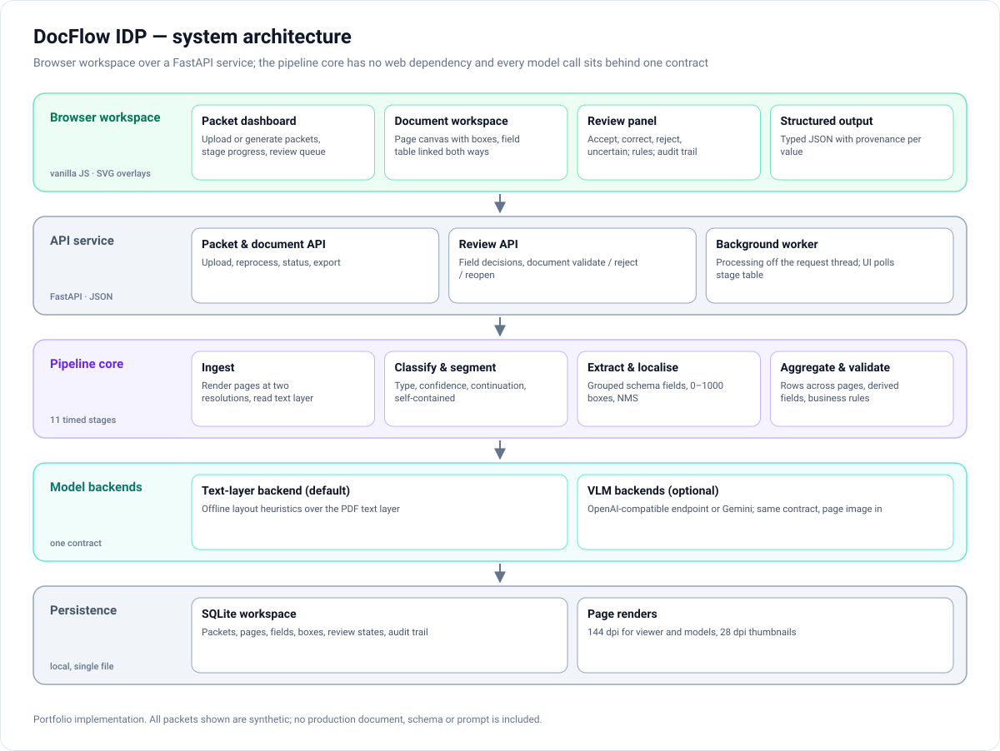

# Architecture

[← Back to README](../README.md)

DocFlow IDP is split into four layers with one-way dependencies: the browser workspace talks to a small API service; the service drives the pipeline core; the core calls models only through a backend contract; everything is persisted locally.

## Components

| Layer | Component | Responsibility |
|---|---|---|
| **Browser workspace** | Packet dashboard | Packets, their documents (coloured by type), stage progress, review queue, upload or *generate synthetic packet*. |
| | Document workspace | Page thumbnails coloured by class, page canvas with zoom/pan and SVG box overlays, field table linked to boxes in both directions. |
| | Review panel | Flagged fields, source-region crop, accept / correct / reject / uncertain with a note, rule results, document validate / reject / reopen, audit trail. |
| | Structured output | Typed JSON for a document or a packet, copy and download. |
| **API service** | FastAPI | JSON endpoints for packets, documents, fields, review decisions and export; serves the static front end. |
| | Background worker | Runs the pipeline off the request thread; the front end polls the stage table while a packet is processing. |
| **Pipeline core** | Eleven timed stages | Ingest → classify → segment → select schema → plan field groups → extract → localise → aggregate rows → derive & validate → review queue → export. No web dependency; testable headless. |
| | Review service | The field and document state machines, rule re-evaluation on every decision, audit trail. |
| **Model backends** | Backend contract | *Classify a page* (with the previous page's verdict), *extract a field group* (with values already known), *localise a value* (returns 0–1000 candidate boxes). |
| | Text-layer backend (default) | Offline layout heuristics over the PDF text layer; the baseline and test harness. |
| | VLM backends (optional) | OpenAI-compatible endpoint or Gemini, answering the same contract from the page image. |
| **Persistence** | Local SQLite workspace | Packets, pages, documents, fields, boxes, review states and the audit trail in one file in the user's data folder. |

## The backend contract

The contract is deliberately small — three questions a model must answer:

Keeping *extract* and *localise* separate means a cheap extractor can be paired with a stronger localiser (or the other way round), and each can be evaluated against ground truth on its own. It is also the seam where a locally fine-tuned VLM would plug in — see [model_strategy.md](model_strategy.md).

## Processing model

- Each request and the worker open their own database connection; no connection is shared between threads.
- Pages are rendered twice: 144 dpi for the viewer and the models, 28 dpi for thumbnails.
- Each stage records its measured time and a one-line summary, which the UI shows as a pipeline strip.
- Reprocessing a packet re-runs every stage from the stored PDF.

## Design decisions

| Decision | Why |
|---|---|
| Browser workspace, no build step | A document review tool is naturally a web page: canvas, overlays, tables, deep links. |
| Boxes in 0–1000 page units | Resolution-independent; matches what VLMs are commonly prompted to return; converted to pixels only for display and export. |
| Review state lives with the data | The export always reflects the current review state; there is no separate "approved copy" to drift. |
| Offline baseline backend | The whole workflow can be demonstrated and tested without network access or API keys. |
