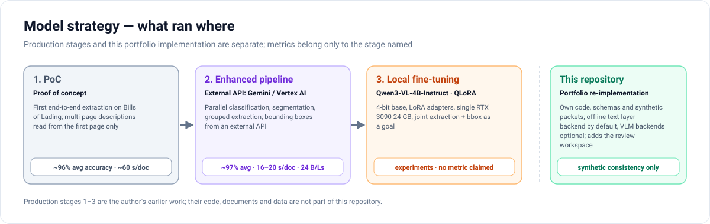

# Model strategy

[← Back to README](../README.md)

This page separates four things that are easy to blur: an early proof of concept, an enhanced production pipeline, later local fine-tuning experiments, and this portfolio re-implementation. **Each result below belongs only to the stage it is listed under.**

## 1. Proof of concept (production work, earlier)

A first end-to-end extraction on Bills of Lading. Long multi-page descriptions were read from the first page only.

- Reported: ~96 % average accuracy, ~60 s per document.

## 2. Enhanced pipeline (production work)

The design this repository mirrors: parallel page classification, dual-resolution rendering, continuation-aware segmentation, schema-driven grouped extraction and a separate localisation pass, followed by row alignment and derived-field rules.

- **Models:** an external VLM API (Gemini / Vertex AI) for classification and extraction. Bounding boxes at this stage also came from an external API.
- **Reported:** ~97 % average accuracy at 16–20 s per document on a 24-document Bill of Lading test set, with multi-page descriptions retrieved correctly.

## 3. Local fine-tuning (later experimentation)

Work toward running extraction and bounding-box localisation locally instead of through an external API.

- **Model:** Qwen3-VL-4B-Instruct, fine-tuned with QLoRA — 4-bit quantised base, LoRA adapters, a single RTX 3090 (24 GB).
- **Goal:** joint extraction + bbox localisation with confidence and structured JSON output, using review feedback (corrections, confirmations, confirmed boxes) as training signal.
- **Status:** experimentation. **No accuracy or speed figure is claimed for Qwen3-VL or for any fine-tuned model.**

## 4. This repository

An independent re-implementation of the design with its own schemas and synthetic data, adding the review workspace, the audit trail and an offline baseline backend.

- **Default backend:** text-layer heuristics (offline, deterministic).
- **Optional backends:** OpenAI-compatible endpoint (e.g. a locally served VLM) or Gemini, through the same three-call contract. Not tested against live services here.
- **Results:** synthetic consistency checks only (see [technical_overview.md](technical_overview.md#testing-approach)).

## Attribution at a glance

| Statement | Correct attribution |
|---|---|
| ~97 % average accuracy, 16–20 s/document | Enhanced production pipeline on an external VLM API, 24 Bills of Lading |
| ~96 %, ~60 s/document | Proof of concept |
| Qwen3-VL-4B-Instruct + QLoRA | Local fine-tuning experimentation — no metric |
| 100 % page types / splits / values, mean box IoU 0.79 | This repository's baseline on **synthetic** packets it generates itself |

## Why the backend contract matters here

Because classification, extraction and localisation are separate calls with structured outputs, moving from an API model to a local fine-tuned model is a backend swap, not a pipeline rewrite — and each task can be evaluated on its own before it is swapped.
