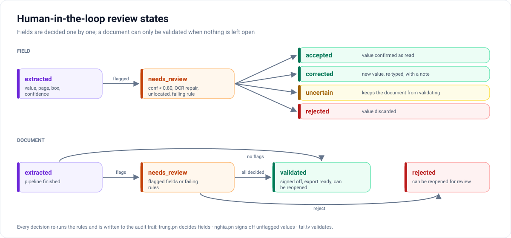
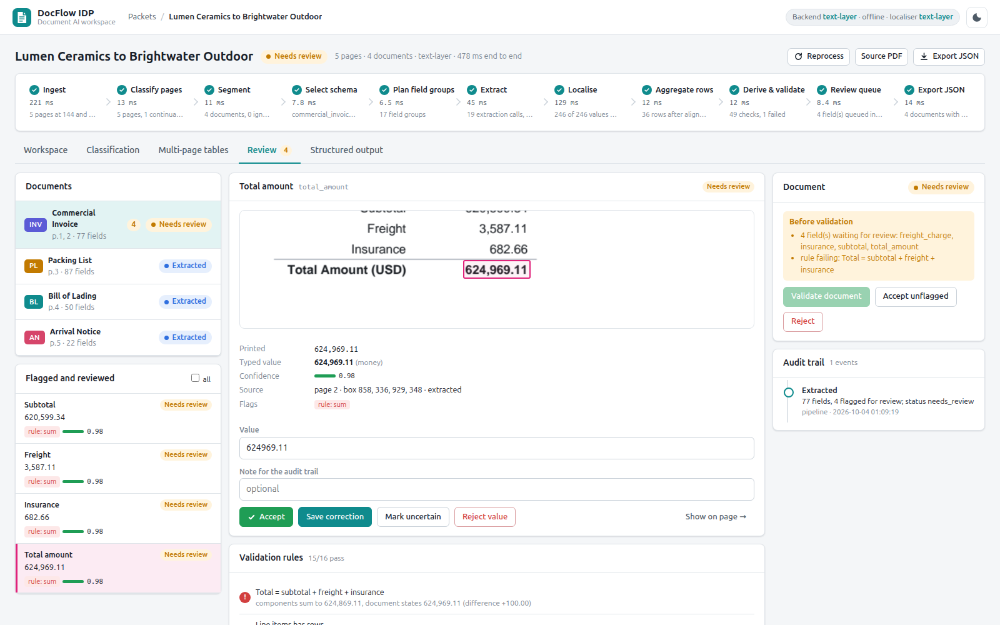
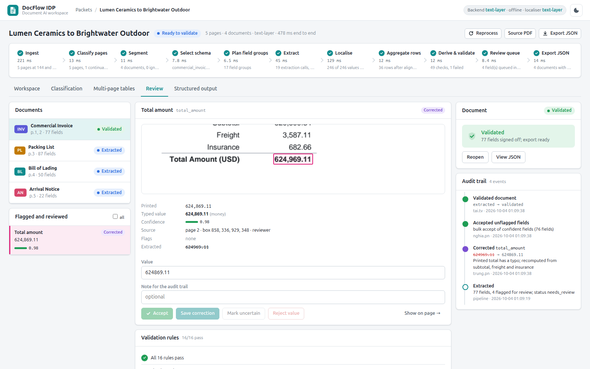

# Review workflow (human in the loop)

[← Back to README](../README.md)

## Why a review loop

A document AI system in operations is judged by what reaches downstream systems, not by what the model extracted. DocFlow IDP treats review as part of the data model: every value has a status, every decision is audited, and a document cannot be validated while anything is still open.

## What gets flagged

| Reason | Example |
|---|---|
| Confidence below 0.80 | An approximate label match lowered the confidence of an invoice date |
| OCR repair | A scanned packing list read a digit as a letter; the value was repaired and flagged |
| Not located | The value was extracted but could not be placed on the page |
| Failing rule | Invoice total ≠ subtotal + freight + insurance: all four fields are flagged together |

## Field states

| State | Meaning |
|---|---|
| `extracted` | Value, page, box and confidence from the pipeline |
| `needs_review` | Flagged for one of the reasons above |
| `accepted` | Confirmed as read |
| `corrected` | Replaced by the reviewer; the new value is validated against the field kind and the note is kept |
| `rejected` | Value discarded |
| `uncertain` | Reviewer could not decide; blocks validation |

Every decision re-runs the rules, so correcting the one wrong total clears the flags on the other fields of that rule.

## Document states

`extracted` → `needs_review` → `validated` or `rejected`; validated and rejected documents can be reopened. Validation is refused while a field is waiting or uncertain, or while a failing rule has not been looked at. Validating signs off every value nobody touched.

## Who does what (demo identities)

| Identity | Role in the demo |
|---|---|
| `trung.pn` | Uploads packets, opens flagged fields, compares them with the source region, corrects or accepts them with a note |
| `nghia.pn` | Signs off the unflagged values in bulk; can reject and reopen a document |
| `tai.tv` | Validates the document once nothing is open |

A typical trail on the Lumen Ceramics invoice: *Extracted* (pipeline, 4 fields flagged) → *Corrected `total_amount`* by `trung.pn` ("printed total has a typo; recomputed from subtotal, freight and insurance") → *Accepted unflagged fields* by `nghia.pn` → *Validated* by `tai.tv`.

| Needs review | Validated |
|---|---|
|  |  |

Each field decision is its own audit entry, so when several fields are flagged, most entries in the trail are `trung.pn`'s.

## Feedback as training data

Corrections and confirmations, together with the boxes they refer to, are exactly the pairs a fine-tuned extractor or localiser needs. The review loop is therefore also the data-collection loop for local model work — see [model_strategy.md](model_strategy.md).
