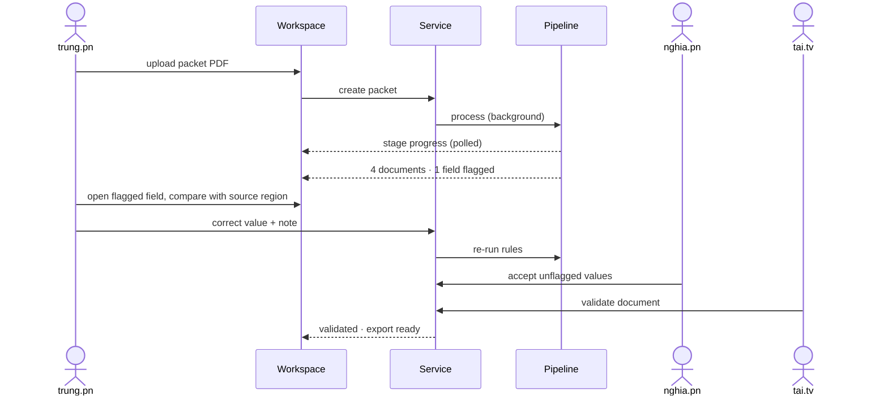

# Workflow

[← Back to README](../README.md)

## The eleven stages

| # | Stage | Input → output | Notes |
|---|---|---|---|
| 1 | **Ingest** | PDF → page images + text layer | Two resolutions (144 dpi, 28 dpi); a box per character from the text layer. Scanned pages (an image covering the page) are detected and read from their OCR layer. |
| 2 | **Classify pages** | page → type, confidence, continuation, self-contained | Types: Bill of Lading, Commercial Invoice, Packing List, Arrival Notice, `IGNORE` (terms, blank). The previous page's verdict is part of the input. |
| 3 | **Segment** | pages → documents | Continuations join the open document of the same type; any other page starts a new one. `IGNORE` pages fold into the document before them. An orphan continuation starts a document with lowered confidence. |
| 4 | **Select schema** | document type → schema | Typed fields (text, party block, date, number, money, container number, code) and tables (containers, line items, packages, charges). |
| 5 | **Plan field groups** | schema → small groups | Grouped by section; every table is its own group. Small groups keep each model call focused. |
| 6 | **Extract** | page + group → values | Page 1 is asked for the full schema; continuation pages only for still-empty fields plus table rows, which are appended. |
| 7 | **Localise** | value → box | Candidate boxes in 0–1000 coordinates; non-maximum suppression keeps the best non-overlapping candidate; cells are searched inside their row; labels nearby are preferred. |
| 8 | **Aggregate rows** | per-page rows → one table | Wrapped description lines merged into their row, "carried forward / brought forward" lines dropped, repeated rows kept once; every row keeps its source page. |
| 9 | **Derive & validate** | fields → rule results | Missing totals derived from rows; checks for sums with tolerance, quantity × unit price, date order, ISO 6346 check digits, required fields, formats, cross-document references. |
| 10 | **Review queue** | rule results + confidence → flags | Flag when confidence < 0.80, an OCR repair was needed, the value could not be located, or a failing rule involves it. |
| 11 | **Export** | reviewed document → JSON | Typed values with printed text, confidence, status, source, page and box (page units and pixels); always reflects the current review state. |

## A packet, end to end

In the demo, `trung.pn` is the operator for every packet: uploads, field decisions and correction notes are signed by `trung.pn`; the sign-off and validation steps are the only ones signed by someone else.

## Injected problems in the demo packets

| Packet | Problem | Where it surfaces |
|---|---|---|
| Northwind Textiles | Container number with a wrong check digit on the continuation sheet | ISO 6346 rule fails; that cell is flagged |
| Lumen Ceramics | Invoice total 100.00 above subtotal + freight + insurance | Sum rule fails; four fields flagged; validation blocked |
| Copperleaf Furniture | Scanned packing list whose OCR reads a digit as a letter | Scan detected; value repaired, confidence lowered, flagged |
| Copperleaf Furniture | Invoice date under the label "Invoice Dated" | Approximate label match, lower confidence, flagged |
| Copperleaf Furniture | Arrival notice titled "Notice of Cargo Arrival", referring to a B/L not in the packet | Classified with lower confidence; cross-reference warning |
| Bluegate Electronics | Two bills of lading back to back | Split into two documents; nothing flagged |

All packet names are fictional.
